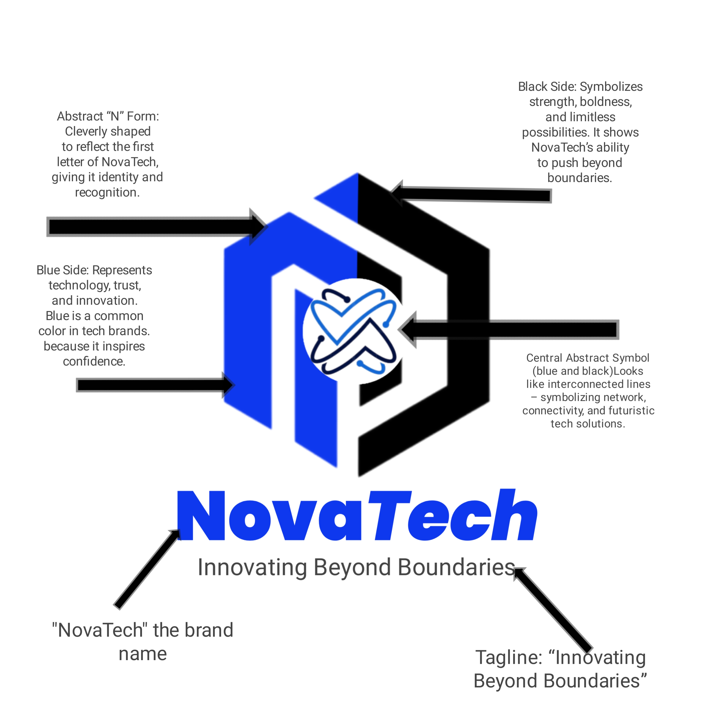
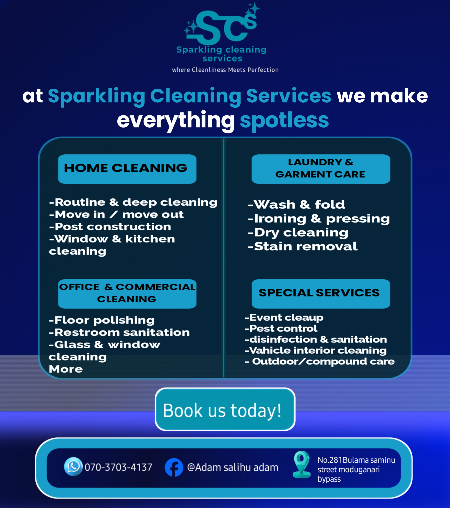

<!--Section 1: Introduce your self-->
## ABOUT ME

Hello! I'm Adam salihu adam 🤓, a  passionate and creative graphics designer dedicated to turning ideas into strinking expriaces. i specialize in crafting mordern,minimalist and impactful designs that help brands stand out with clarity and stalye.with expriance across brand identity,social design.

<!--Mention your top/relevant skills here - core and soft skills-->
## WHAT I DO

*As the creavive director of luxeadge creative hub,i provide branding, design, and digital contain services for businesses, influencers, and brand *

**- ✅ Brand identity**
 i create logo,color palletes, typography system,and complete brand identites that bussinesses a strong and memorable visual presence.

**- ✅ Graphics design**
from social media post to flayers,posters,banners,and promotional material, i design eye-catching visuals taiolored to your brand style

## My portfolio
*A glimse of some of the project i have work.*
*moedern logos & Brand identity

*social media & Markerting Design projects
High-engagement creatives used for promotions and campaigns.
Designed engaging social media templates and marketing visuals for multiple businesses.

## CONTACT DETAILS

*Let’s connect and see how we can make a difference together!*
<table>
  <tbody>
    <tr>
      <td>📧</td>
      <td><a href="aadamsalihu34@gmail.com">aadamsalihu34@gmail.com</a></td>
    </tr>
    <tr>
      <td>📞</td>
      <td>(234) 9028-149-646</td>
    </tr>
    <tr>
      <td>📍</td>
      <td>PH, Nigeria</td>
    
 

   

